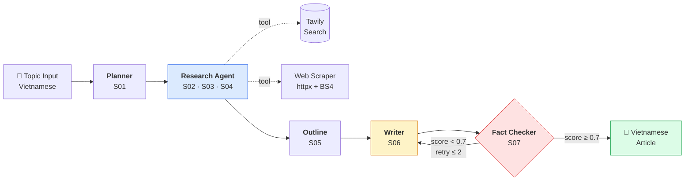

# langgraph-writer

> **Multi-agent Vietnamese content writing pipeline.** Fact-checked AI articles, sourced and original, in under 5 minutes.


A production-grade multi-agent system that researches topics on the Vietnamese web, drafts long-form articles in natural Vietnamese, and fact-checks claims against sources — with an evaluation harness from day one.

> 🚧 **This project is in active development.** Foundation + research agent are complete (W2). Writer, fact-checker, frontend, and deployment land in W3-W7. The codebase, decision history, and engineering process are all public — see [Engineering Practices](#engineering-practices) for what makes this a portfolio piece, not just an AI wrapper.

---

## Why This Exists

Most AI writing tools (ChatGPT, Jasper, Copy.ai) treat Vietnamese as an afterthought. The result: translation-ese, awkward tone, hallucinated statistics, no sources. Vietnamese content creators end up rewriting AI output by hand.

**`langgraph-writer` is Vietnamese-first.** Every prompt, every agent, every eval is tuned for Vietnamese output quality. The pipeline cites sources by URL. A fact-check agent flags unsupported claims and loops back to the writer if confidence drops below threshold.

**Differentiators**:
- **Native Vietnamese output** — prompts, tone, structure, idioms (no translation layer)
- **Sourced + fact-checked** — every claim traceable to a Tavily-found URL
- **Self-correcting** — rewrite loop when fact-check score < 0.7 (capped at 2 retries)
- **Eval harness from day one** — RAGAS + LangSmith tracing, not bolted on later
- **Multi-provider** — Anthropic, OpenAI, Google, Ollama all supported via factory pattern

---

## Architecture



**State management**: A single `WriterState` TypedDict flows through the graph. List fields (`sources`, `queries`) use `Annotated[..., add]` reducers; scalars overwrite. Checkpointer (`MemorySaver` in dev, `SqliteSaver` in prod) enables graph resume after failures.

**Why LangGraph over CrewAI / AutoGen**: native streaming, conditional edges for the rewrite loop, first-class typing, and a checkpointer that's actually production-grade. See [`DECISIONS_LOG.md`](./DECISIONS_LOG.md) D-001 for the full rationale.

---

## Tech Stack

| Layer | Tool | Why |
|---|---|---|
| **Orchestration** | LangGraph 0.2+ | Native streaming, conditional edges, checkpointing |
| **LLM framework** | LangChain 0.3+ | Provider abstraction, structured output |
| **LLM provider** | Anthropic Claude (Sonnet 4.5 + Haiku) | Best Vietnamese quality; Haiku for cost-sensitive map steps |
| **Multi-provider** | Anthropic / OpenAI / Google Gemini / Ollama | Swap via `LLM_PROVIDER` env; all 4 supported |
| **Web search** | Tavily | LLM-optimized search, decent Vietnamese coverage |
| **Web scraping** | httpx + BeautifulSoup4 | Async, UTF-8 forced for Vietnamese sites |
| **Backend** | FastAPI + sse-starlette | Async-native, OpenAPI free, SSE streaming |
| **Validation** | Pydantic v2 | Structured LLM outputs, API contracts |
| **Database + Auth** | Supabase (Postgres + RLS) | One service, generous free tier *(W5)* |
| **Frontend** | Next.js 14 App Router | SSR, streaming UI *(W6)* |
| **Observability** | LangSmith | Tracing every graph run |
| **Evaluation** | RAGAS + custom LLM judges | Faithfulness, answer relevancy, Vietnamese fluency |
| **Testing** | pytest + pytest-asyncio | Mocked LLM tests for every node |
| **Tooling** | ruff, mypy, uv | Modern Python toolchain |
| **Payments** | Stripe | Subscription tier *(W7)* |

---

## Quick Start

### Prerequisites

- Python 3.12+
- [uv](https://github.com/astral-sh/uv) (`curl -LsSf https://astral.sh/uv/install.sh | sh`)
- Anthropic API key ([console.anthropic.com](https://console.anthropic.com))
- Tavily API key ([tavily.com](https://tavily.com))

### Setup

```bash
# Clone
git clone https://github.com/<your-username>/langgraph-writer.git
cd langgraph-writer

# Install dependencies
uv sync

# Configure environment
cp .env.example .env
# Edit .env and add your API keys
```

### Run a smoke test

```bash
# Quick end-to-end test (uses real APIs)
uv run python scripts/smoke_research.py
```

Expected output: 5-10 Vietnamese sources collected, summarized, and relevance-filtered for the test topic.

### Run the API server

```bash
cd backend
uv run uvicorn app.main:app --reload --port 8000
```

Visit `http://localhost:8000/docs` for the OpenAPI interface, or:

```bash
curl -X POST http://localhost:8000/api/v1/generate \
  -H "Content-Type: application/json" \
  -d '{
    "topic": "Tác động của AI đến thị trường lao động Việt Nam",
    "tone": "trang trọng",
    "target_length": 800
  }'
```

For complete setup including environment variables, see [`SETUP_GUIDE.md`](./SETUP_GUIDE.md).

---

## Project Structure

```
langgraph-writer/
├── backend/
│   ├── app/
│   │   ├── main.py              # FastAPI entrypoint
│   │   ├── config.py            # Settings (pydantic-settings)
│   │   ├── api/                 # HTTP routes
│   │   ├── graph/
│   │   │   ├── state.py         # WriterState TypedDict
│   │   │   ├── builder.py       # StateGraph compile
│   │   │   ├── edges.py         # Conditional routing
│   │   │   └── nodes/           # One file per agent
│   │   ├── prompts/templates.py # All prompts (Vietnamese)
│   │   ├── tools/               # Tavily, scraper
│   │   ├── llm/client.py        # Multi-provider factory
│   │   ├── models/schemas.py    # Pydantic v2
│   │   └── utils/               # Logger, exceptions
│   └── tests/
│       ├── unit/                # Mocked LLM tests
│       ├── integration/         # Full graph tests
│       └── evals/               # RAGAS evaluation
├── scripts/
│   └── smoke_research.py        # Diagnostic E2E runner
├── frontend/                    # Next.js (W6)
└── docs/
    ├── context.md               # Project foundation (read first)
    ├── RULES.md                 # Coding conventions
    ├── SKILLS.md                # Agent skill catalog
    ├── SETUP_GUIDE.md           # Step-by-step setup
    ├── DECISIONS_LOG.md         # Append-only decision history
    ├── CURRENT_STATE.md         # Real-time project dashboard
    ├── HANDOFF.md               # Session-to-session bridge
    └── compress.md              # Long-conversation compression
```

---

## Implemented Skills

Each agent capability is tracked as a numbered **Skill** in [`SKILLS.md`](./SKILLS.md) with status, dependencies, eval metrics, and acceptance criteria.

| ID | Name | Status | What it does |
|---|---|---|---|
| **S01** | Topic Planner | 🟢 Done | Analyzes topic → research angles, audience, depth |
| **S02** | Query Generator | 🟢 Done | Plan → 3-5 search queries (VN + EN mix) |
| **S03** | Web Researcher | 🟢 Done | Tavily search + parallel scrape + dedup |
| **S04** | Source Summarizer | 🟢 Done | Map-reduce summarization + fact extraction + relevance filter |
| **S05** | Outline Generator | 🔴 W3 | Sources → 4-6 section structured outline |
| **S06** | Content Writer | 🔴 W3 | Streaming Vietnamese article generation |
| **S07** | Fact Checker | 🔴 W4 | Claim-source verification + rewrite trigger |
| **S08** | Style Editor | 🔴 Post-MVP | Removes "dịch máy" patterns, tightens prose |
| **S09** | SEO Optimizer | 🔴 Post-MVP | Title variants, meta description, H2/H3 placement |
| **S10** | Image Suggester | 🔴 Post-MVP | Stock image search terms per section |
| **S11** | Citation Formatter | 🔴 Post-MVP | Inline citations + bibliography |

Legend: 🟢 Done · 🟡 In Progress · 🔴 Planned · 🔵 Optimized · ⚫ Deprecated

---

## Roadmap

| Week | Focus | Status |
|---|---|---|
| **W0** | Foundation, RULES, SKILLS, context system | ✅ Complete |
| **W1** | Planner node (S01) end-to-end with LangSmith trace | ✅ Complete |
| **W2** | Research pipeline (S02 + S03 + S04) | ✅ Complete (Anthropic-validated) |
| **W3** | Outline (S05) + Writer (S06) streaming output | 🟡 Next |
| **W4** | Fact-check (S07) + RAGAS eval harness | 🔴 Planned |
| **W5** | FastAPI complete + Supabase auth + persistence | 🔴 Planned |
| **W6** | Next.js UI + Stripe sandbox + Vercel/Railway deploy | 🔴 Planned |
| **W7** | Polish + portfolio writeup + soft launch (5+ users) | 🔴 Planned |

Live progress and blockers: [`CURRENT_STATE.md`](./CURRENT_STATE.md).

---

## Engineering Practices

This is where the project differentiates from typical "AI-wrapped-in-FastAPI" portfolios. The processes documented below are deliberate — they reflect production engineering discipline applied to a solo summer project.

### Documentation-first development

Eight markdown files were written **before any code**. They define identity (`context.md`), rules (`RULES.md`), capabilities (`SKILLS.md`), and process (`HANDOFF.md` + `CURRENT_STATE.md`). New contributors (human or AI) read the docs first; the code is the implementation, not the spec.

### Decision-driven, not vibe-driven

Every architectural choice is logged in [`DECISIONS_LOG.md`](./DECISIONS_LOG.md) (append-only, never edited). Each entry has Context, Decision, Alternatives Considered, Rationale, and Consequences. Examples:

- **D-001**: Why nodes are pure async functions, not classes
- **D-003**: Why no parallel English pipeline (Vietnamese-only by design)
- **D-014**: How `langchain-anthropic==1.4.5` API drift was discovered and pinned
- **D-016**: Why dev smoke uses paid Anthropic (lesson learned from free-tier debugging)

The log captures both successes and reversed decisions — the historical record is preserved verbatim. This is what recruiters look for when they ask "why did you choose X" in an interview.

### Skills-as-vocabulary

The 11 skills (S01-S11) are the project's stable nouns. They appear in commits (`feat/s03-research-node`), PRs, evals, and conversations. When the "Research" node was renamed to "Web Researcher", every reference still resolved because IDs are stable. [`SKILLS.md`](./SKILLS.md) is a one-page mental model of the whole product.

### Multi-AI development workflow

Implementation is delegated to **Codex GPT** via structured prompts; design and review are handled by **Claude** via audit prompts. Each Codex prompt enforces a strict "Honesty Checklist" — Codex must self-attest before submitting code, and is required to use `[BLOCKED]` stops instead of fabricating results when inputs are missing.

This catches issues that would otherwise ship: an early audit caught a real `langchain-anthropic` 1.4.5 API breakage that mypy initially flagged as 10 type errors. Codex inspected the actual library signature (rather than cargo-culting `# type: ignore`), discovered the param rename, and logged D-014 with the version pin.

The full series of audit prompts is preserved in this repo as documentation of the engineering process.

### Honest engineering

Static validation (`ruff`, `mypy`, `pytest`) is green at every milestone. Live smoke tests don't ship as "passed" if any test produced fewer sources than the target — Codex's audit Honesty Checklist explicitly forbids hiding deviations. Skills are not promoted from 🟡 to 🟢 without explicit pass criteria.

### Eval harness from day one

LangSmith tracing is wired into the graph from W1, not "added later". RAGAS metrics (`faithfulness`, `answer_relevancy`, `context_precision`) land in W4 alongside the fact-checker. Vietnamese-specific custom LLM judges supplement RAGAS where the standard metrics don't capture tone or naturalness. Recruiter signal: this isn't a "wait until production to add tests" portfolio.

### Multi-provider resilience

The LLM client uses a factory pattern (`get_llm()`) supporting Anthropic, OpenAI, Google Gemini, and Ollama. The provider is selected via `LLM_PROVIDER` env var; the pipeline code is provider-agnostic. This made it possible to swap providers mid-development without refactoring (and to discover provider-specific quirks like Google's June 2026 API key format migration, which broke Gemini for many users).

---

## Sample Workflow

**Request**:
```json
{
  "topic": "Tác động của AI đến thị trường lao động Việt Nam",
  "tone": "trang trọng",
  "target_length": 800
}
```

**Pipeline execution** (visible via LangSmith trace):
1. **Planner** extracts research angles: statistics, expert opinions, sector breakdowns, future trends
2. **Query generator** produces 3-5 search queries mixing Vietnamese + English
3. **Web researcher** executes Tavily search → fetches URLs in parallel → cleans text
4. **Map summarizer** (Haiku) produces per-source summary + atomic facts
5. **Reduce judgment** (Sonnet) filters facts by topic relevance, scores per-source
6. **Outline generator** *(W3)* produces 4-6 sections with key points
7. **Writer** *(W3)* streams 800-word Vietnamese article grounded in facts
8. **Fact checker** *(W4)* audits claims; loops to writer if score < 0.7

**Output**: Markdown article in Vietnamese with inline source citations, ready to copy into any CMS.

---

## Testing

```bash
# Static validation
uv run ruff check app/
uv run ruff format --check app/
uv run mypy app/ --ignore-missing-imports

# Unit tests (mocked LLMs, fast)
uv run pytest tests/unit/ -v

# Integration tests (real LLMs, slower)
uv run pytest tests/integration/ -v

# Evaluation harness (W4+)
uv run pytest tests/evals/ -v --runslow
```

Current coverage: 6/6 unit tests pass on the research pipeline. Integration tests and RAGAS evals land in W4 alongside the fact-checker.

---

## Contributing

This is currently a solo portfolio project, not accepting external contributions during the 7-week MVP build. After W7 launch, contributions welcome via standard fork → PR flow.

If you're a recruiter or fellow engineer interested in the approach, feel free to open an Issue with questions about specific decisions in [`DECISIONS_LOG.md`](./DECISIONS_LOG.md).

---

## About

Built solo over 7 weeks by a Computer Science junior specializing in AI Engineering. Goal: a portfolio piece demonstrating production-grade LangGraph + multi-agent orchestration + harness engineering, plus a real product that Vietnamese content creators can use.

The full engineering history — every decision, every blocker, every pivot — is in the repo. No edits, no retcons.

---

*Last updated: Week 2 (research agent validated against Anthropic Claude Sonnet 4.5)*